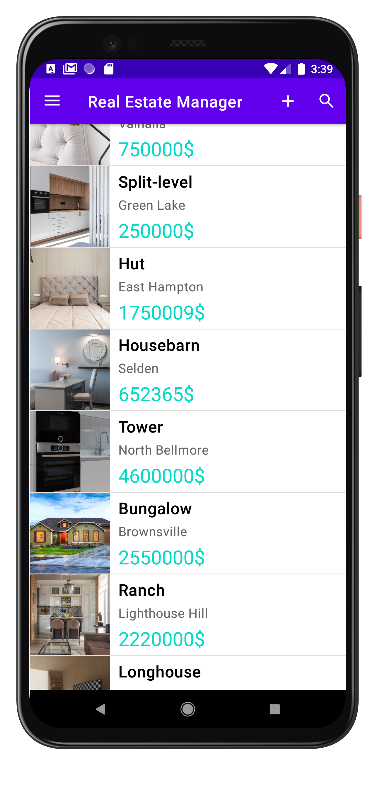
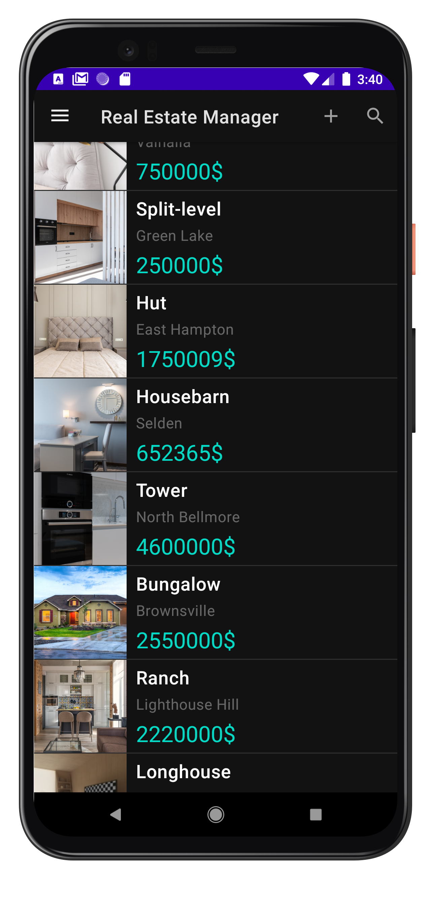
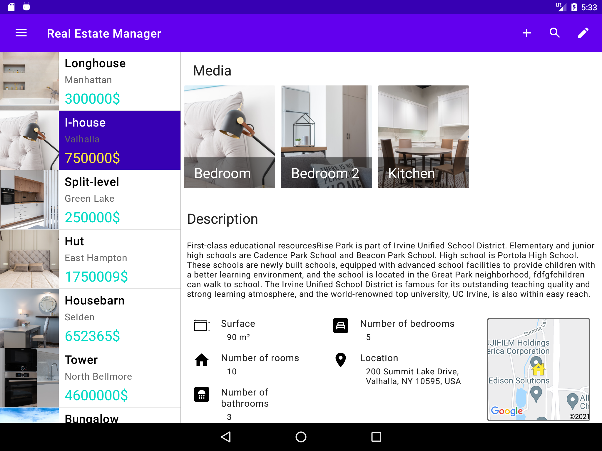

### Authentification for testing
* Email: david.dekeuwer@gmail.com
* Password: unmotdepasse

# Real Estate Manager
A tool for real estate agents to get organized. Save the estates info into the application and work from anywhere thanks to a cloud storage. Weither you work on your smartphone or on your tablet, the comfort will still be the same thanks to an adaptive design!

 

 &nbsp;&nbsp;&nbsp;&nbsp;&nbsp;&nbsp;&nbsp;&nbsp;&nbsp;&nbsp;&nbsp;&nbsp;

## Features
* **Log in** with an email/password
* Show a list of estates
* Multicriteria filtering (price, surface area, room count, type...)
* A **detail** screen with more information of a particular estate:
    * the photos
    * the description
    * the figures (surface area, room count, bedroom count...)
    * the address
    * the photo of the estate's location on a map with the nearby places
* **Create/Modify** an existing estate
* **Geolocalise** the user and show all estates on a **map**
* **Dual pane** mode for tablet
* **Offline mode**, can create/modify without internet connection and will be **sync** to the back-end at a later time.
* **Notify** the user when all the added/modified estates in offline mode has been sync to the back-end
* Dark mode is implemented

## Technologies
* Room
* Retrofit
* Kotlin Coroutines
* Flow
* Mockito
* Databinding
* Robolectric
* Preferences (Settings)
* Koin
* Glide
* Maps Android SDK
* Firebase UI
* Firebase Auth
* Firebase Firestore
* Firebase Storage
